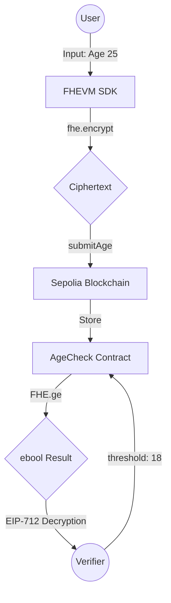

# Private Age Check

**Private Age Check** is a privacy-preserving application that allows users to verify their age without revealing it, using **Fully Homomorphic Encryption (FHE)** powered by [Zama](https://www.zama.ai/) and the **Sepolia Testnet**.

## Features

*   **Privacy-First Verification**: Users encrypt their age locally using FHE. The encrypted age is submitted on-chain and verified against thresholds (e.g., "Is Over 18?") without ever decrypting the actual value.
*   **Wallet Integration**: Seamlessly connect your wallet (MetaMask, Rabbit, etc.) using [RainbowKit](https://www.rainbowkit.com/) and [WalletConnect](https://walletconnect.com/).
*   **Real Encryption**: Utilizes `fhevmjs` to perform actual FHE encryption in the browser.
*   **Modern UI**: Built with React, Vite, Tailwind CSS, and shadcn/ui for a premium, responsive experience.

## Tech Stack

*   **Frontend**: React, TypeScript, Vite
*   **Styling**: Tailwind CSS, shadcn/ui
*   **Web3**: wagmi, viem, RainbowKit
*   **Encryption**: Zama `fhevmjs` / Relayer SDK v0.3.0-5

## Technical Architecture

AgeVault leverages the Zama FHEVM to perform **Compute-to-Data** without ever exposing the underlying user data.



### Core Architecture Highlights
- **Local Encryption**: Data is encrypted using `fhevmjs` before it ever touches the network.
- **On-Chain Privacy**: The contract stores `euint8` (encrypted 8-bit integers).
- **Homomorphic Comparison**: Verification happens via `FHE.ge(userAge, threshold)` - comparing encrypted values without decryption.

## Zama Developer Program - Builder Track

This project is built as part of the Zama Developer Program. It fulfills the following judging criteria:

- **Original Tech Architecture**: Uses `@fhevm/solidity@0.10.0` for privacy-preserving age logic.
- **Working Demo**: Deployed on Vercel and Sepolia testnet.
- **Testing**: Comprehensive unit test suite included in `/test`.
- **UI/UX**: Custom "Neon-Glassmorphism" design with real-time FHE status feedback.

### Prerequisites

*   Node.js (v18+ recommended)
*   npm or yarn

### Installation

1.  Clone the repository:
    ```bash
    git clone <repository-url>
    cd private-age-check
    ```

2.  Install dependencies:
    ```bash
    npm install
    ```

### Configuration

1.  **Create a `.env` file** in the root directory with the following variables:
    ```bash
    # WalletConnect Project ID (required)
    # Get one at https://cloud.walletconnect.com
    VITE_WALLETCONNECT_PROJECT_ID=your_project_id_here

    # Sepolia RPC URL (required)
    # Get one from Infura, Alchemy, or other providers
    VITE_SEPOLIA_RPC_URL=https://sepolia.infura.io/v3/your_infura_key

    # AgeCheck Contract Address (required after deployment)
    # Deploy the contract first, then set this address
    VITE_CONTRACT_ADDRESS=0x0000000000000000000000000000000000000000

    # Zama Relayer URL (optional, defaults to official testnet relayer)
    # See: https://docs.zama.org/protocol/solidity-guides/smart-contract/configure/contract_addresses
    VITE_ZAMA_RELAYER_URL=https://relayer.testnet.zama.org
    ```

2.  **Deploy the Contract**: Deploy the `AgeCheck.sol` contract to Sepolia testnet:
    ```bash
    npx hardhat run scripts/deploy.js --network sepolia
    ```
    Then update `VITE_CONTRACT_ADDRESS` in your `.env` file with the deployed address.

### Run Locally

Start the development server:

```bash
npm run dev
```

Open your browser to `http://localhost:8080`.

## How It Works

1.  **Connect Wallet**: Connect your Web3 wallet to the Sepolia network.
2.  **Encrypt Age**: On the Dashboard, enter your age. It is encrypted locally using FHE before leaving your browser.
3.  **Submit**: The encrypted age is submitted to the smart contract on-chain. An event is emitted to confirm the submission.
4.  **Verify**: Go to the **Verify** page. Enter a wallet address to check if they have submitted an encrypted age. You can then verify conditions like "Is Over 18?" using the contract's `verifyAge` function, which performs homomorphic comparison operations on the encrypted data.

## Smart Contract Features

The `AgeCheck` contract includes:
- **`submitAge`**: Stores an encrypted age for a user (emits `AgeSubmitted` event)
- **`hasEncryptedAge`**: Checks if a user has submitted an encrypted age
- **`verifyAge`**: Performs homomorphic comparison to check if a user's encrypted age meets a threshold (returns encrypted boolean)
- **`getEncryptedAge`**: Retrieves the encrypted age for a user (as bytes32)

## Important Notes

- **Decryption**: The `verifyAge` function returns an encrypted boolean (`ebool`). To get the actual boolean result, you need to decrypt it using the relayer SDK's decryption methods. See the [Zama Protocol Decryption documentation](https://docs.zama.org/protocol/relayer-sdk-guides/fhevm-relayer/decryption) for details on how to implement decryption with proper authorization.
- **Relayer SDK**: The application now uses `@zama-fhe/relayer-sdk` with `SepoliaConfig` for simplified configuration. All contract addresses are automatically configured according to the [official Zama documentation](https://docs.zama.org/protocol/solidity-guides/smart-contract/configure/contract_addresses).
- **Environment Variables**: All configuration is now done through environment variables. Make sure to set up your `.env` file before running the application.
- **Network**: The application is configured for Sepolia testnet. Make sure your wallet is connected to Sepolia.
- **Documentation**: For more information, see the [Zama Protocol documentation](https://docs.zama.org/protocol).

## License

MIT
